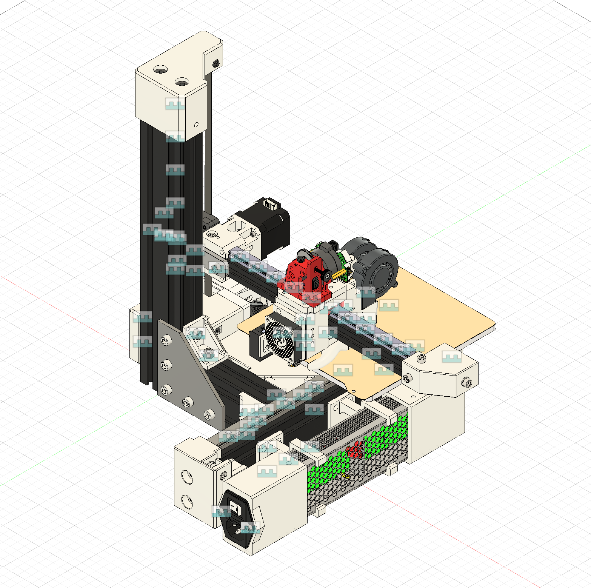

# Printer Sugar

### **Work In Progress!**

Printer Sugar is a fast cantilever 3D printer with quality components and a rigid frame.

## Features
- Cartesian with belted Z
- Compact size
- 180x180x180mm build volume
- Easy to assemble
- No drilling
- Runs Klipper
- Super fast bed meshes with BTT Eddy sensor
- Toolhead CAN board
- Driven by the affordable BTT SKR Pico
- Quality components
- Easy to build

## BOM
|Part|Notes|Qty|Price (EUR)|Shipping|Total Price|Link                                                                                                                        |
|---------------------------|-----------------------------------------------|---|-----------|--------|-----------|----------------------------------------------------------------------------------------------------------------------------|
|TZ V6 2.0 hotend           |                                               |1  |15,17 €    |0,00 €  |15,17 €    |https://www.aliexpress.com/item/1005008625753387.html                                                                       |
|HGX Lite extruder          |                                               |1  |22,45 €    |0,00 €  |22,45 €    |https://www.aliexpress.com/item/1005008095324836.html                                                                       |
|Raspberry Pi               |already have one on hand                       |0  |0,00 €     |0,00 €  |0,00 €     |https://raspberrypi.com                                                                                                     |
|BTT SKR Pico 1.0           |                                               |1  |22,63 €    |0,00 €  |22,63 €    |https://biqu.equipment/products/btt-skr-pico-v1-0?variant=40565262188642                                                    |
|BTT Eddy Coil              |                                               |1  |12,76 €    |0,00 €  |12,76 €    |https://biqu.equipment/products/bigtreetech-eddy?variant=41018205405282                                                     |
|Fystec UCAN                |cheaper to buy this with the eddy coil than duo|1  |6,31 €     |0,00 €  |6,31 €     |https://www.aliexpress.com/item/1005006834027165.html                                                                       |
|BTT EBB36                  |                                               |1  |14,46 €    |0,00 €  |14,46 €    |https://biqu.equipment/products/bigtreetech-ebb-36-42-can-bus-for-connecting-klipper-expansion-device?variant=39760665149538|
|5015 Blower Fan            |                                               |2  |2,76 €     |0,00 €  |5,52 €     |https://www.aliexpress.com/item/1005002488988359.html                                                                       |
|ADXL345                    |for bed                                        |1  |2,72 €     |0,00 €  |2,72 €     |https://www.aliexpress.com/item/1005006825808074.html                                                                       |
|4010 Fan                   |                                               |3  |2,51 €     |0,00 €  |7,53 €     |https://www.aliexpress.com/item/10000382046169.html                                                                         |
|2M PTFE tube               |ID2 OD4                                        |1  |3,92 €     |0,00 €  |3,92 €     |https://www.aliexpress.com/item/1005006242932887.html                                                                       |
|IEC320 C14                 |AC-08                                          |1  |2,37 €     |0,00 €  |2,37 €     |https://www.aliexpress.com/item/32961436466.html                                                                            |
|Mean Well UHP-350-24       |                                               |1  |59,12 €    |0,00 €  |59,12 €    |https://www.digikey.ee/en/products/detail/mean-well-usa-inc/UHP-350-24/7707254                                              |
|180x180 bed                |with magnetic plate                            |1  |22,58 €    |0,00 €  |22,58 €    |https://www.aliexpress.com/item/1005005641707683.html                                                                       |
|MGN15H 250mm               |                                               |2  |12,50 €    |0,00 €  |25,00 €    |https://www.aliexpress.com/item/1000007480470.html                                                                          |
|MGN12C 250mm               |                                               |1  |10,09 €    |0,00 €  |10,09 €    |https://www.aliexpress.com/item/1000007480470.html                                                                          |
|Nema 17 motors 40mm        |3pcs                                           |1  |45,03 €    |0,00 €  |45,03 €    |https://www.aliexpress.com/item/1005006568308689.html                                                                       |
|Silicone spacers 4pcs      |16mm                                           |1  |3,14 €     |0,00 €  |3,14 €     |https://www.aliexpress.com/item/1005001823789355.html                                                                       |
|GT2 Loop Belt 188mm        |6mm width                                      |1  |2,67 €     |0,00 €  |2,67 €     |https://www.aliexpress.com/item/1005006417199222.html                                                                       |
|GT2 Loop Belt 650mm        |9mm width                                      |1  |2,01 €     |4,59 €  |6,60 €     |https://www.aliexpress.com/item/32805615376.html                                                                            |
|5x8x1 shim                 |comes in a pack of 20                          |1  |1,08 €     |2,87 €  |3,95 €     |https://www.aliexpress.com/item/1005004050860540.html                                                                       |
|F695 2RS bearings          |pack of 10                                     |1  |6,37 €     |0,00 €  |6,37 €     |https://www.aliexpress.com/item/32850989216.html                                                                            |
|GT2 20T pulley 6mm         |                                               |1  |4,48 €     |0,00 €  |4,48 €     |https://www.aliexpress.com/item/32995102911.html                                                                            |
|GT2 20T idler 9mm          |                                               |1  |3,43 €     |0,00 €  |3,43 €     |https://www.aliexpress.com/item/1005005781354110.html                                                                       |
|GT2 20T pulley 9mm         |                                               |1  |1,35 €     |5,04 €  |6,39 €     |https://www.aliexpress.com/item/32348909911.html                                                                            |
|GT2 80T puley 6mm          |                                               |1  |4,85 €     |2,79 €  |7,64 €     |https://www.aliexpress.com/item/1005005585888163.html                                                                       |
|5x70mm shaft with flat spot|                                               |1  |2,22 €     |5,37 €  |7,59 €     |https://www.aliexpress.com/item/1005008459963157.html                                                                       |
|F695ZZ bearing             |                                               |1  |3,40 €     |0,00 €  |3,40 €     |https://www.aliexpress.com/item/1005006822749704.html                                                                       |
|695ZZ bearing              |                                               |1  |3,24 €     |0,00 €  |3,24 €     |https://www.aliexpress.com/item/4000909556973.html                                                                          |
|3060 extrusion             |350mm                                          |1  |10,57 €    |0,00 €  |10,57 €    |https://hobby-store.pl/en/aluminium-profile-3060-type-t-slot/altrax-aluminium-profile-3060-t-slot-matt-black.html           |
|3060 extrusion             |280mm                                          |1  |8,46 €     |0,00 €  |8,46 €     |https://hobby-store.pl/en/aluminium-profile-3060-type-t-slot/altrax-aluminium-profile-3060-t-slot-matt-black.html           |
|3060 extrusion             |120mm                                          |1  |3,62 €     |0,00 €  |3,62 €     |https://hobby-store.pl/en/aluminium-profile-3060-type-t-slot/altrax-aluminium-profile-3060-t-slot-matt-black.html           |
|L-type connection plate    |                                               |2  |4,00 €     |0,00 €  |8,00 €     |https://www.aliexpress.com/item/1005008549907378.html                                                                       |
|T-type connection plate    |                                               |1  |4,46 €     |0,00 €  |4,46 €     |https://www.aliexpress.com/item/1005008549907378.html                                                                       |
|3030 Corner brackets       |                                               |1  |7,56 €     |0,00 €  |7,56 €     |https://www.aliexpress.com/item/1005007540170351.html                                                                       |
|M3 countersunk 30mm        |                                               |0  |3,69 €     |0,00 €  |0,00 €     |https://www.aliexpress.com/item/1005007838338973.html                                                                       |
|M3 screw set               |                                               |0  |10,34 €    |0,00 €  |0,00 €     |https://www.aliexpress.com/item/1005007159750547.html                                                                       |
|M3 heatset insert          |M3x5x4                                         |0  |3,95 €     |0,00 €  |0,00 €     |https://www.aliexpress.com/item/1005007973137842.html                                                                       |
|M3 heatset insert          |M3x4.5x5                                       |0  |2,92 €     |0,00 €  |0,00 €     |https://www.aliexpress.com/item/1005003582355741.html                                                                       |
|M5 screw set               |                                               |0  |13,36 €    |0,00 €  |0,00 €     |https://www.aliexpress.com/item/1005007268850289.html                                                                       |
|M5 50mm                    |                                               |0  |4,52 €     |0,00 €  |0,00 €     |https://www.aliexpress.com/item/32810872544.html                                                                            |
|M6 screw set               |                                               |0  |14,75 €    |0,00 €  |0,00 €     |https://www.aliexpress.com/item/1005007268850289.html                                                                       |
|M6x12mm                    |                                               |0  |4,11 €     |0,00 €  |0,00 €     |https://www.aliexpress.com/item/1005007632215508.html                                                                       |
|M8 30mm                    |                                               |0  |3,72 €     |0,00 €  |0,00 €     |https://www.aliexpress.com/item/32810872544.html                                                                            |
|3030 M6 t-nuts             |                                               |0  |5,58 €     |0,00 €  |0,00 €     |https://www.aliexpress.com/item/1005007587044629.html                                                                       |
|2020 M5 t-nuts             |                                               |0  |3,13 €     |0,00 €  |0,00 €     |https://www.aliexpress.com/item/1005007587044629.html                                                                       |
|Spade crimping kit         |                                               |0  |21,92 €    |0,00 €  |0,00 €     |https://a.aliexpress.com/_EJTbUyW
|16AWG wire                 |                                               |0  |4,41 €     |0,00 €  |0,00 €     |https://a.aliexpress.com/_EGvjSkQ

## Credits
- Big thanks to the Ratrig community and the team behind Ratrig for the inspiration and refrence for the design.
- EVA toolhead community and team for the refrence for my toolhead.
- Voron community for the insipiration of the CoreXY design and refrences.
- BigTreeTech for the refrence parts of their products.
- GrabCAD community for some refrence parts.